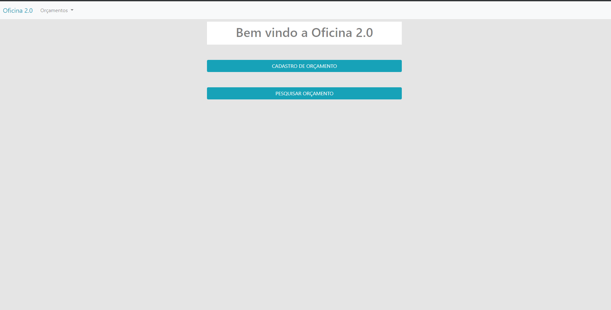
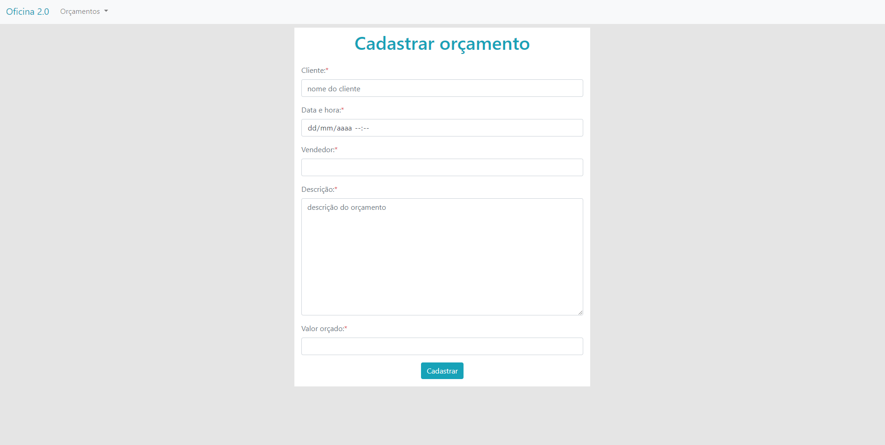
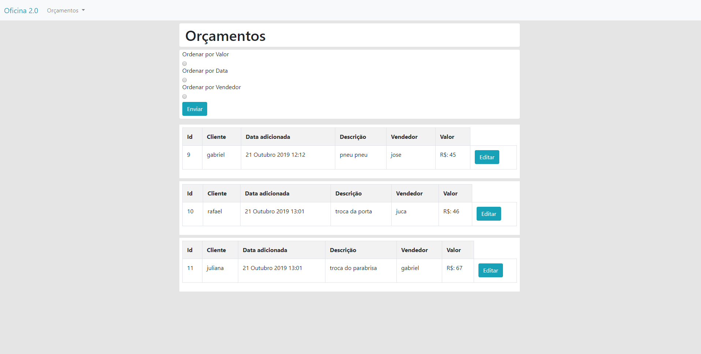

# Oficina 2.0
Sistema de cadastro de orçamento para uma oficina.

# Pagina principal

# Tela de cadastro

# Orçamentos

# Edição e exclusão de orçamentos

# Como testar o sistema !

É necessario que você tenha o Python instalando.
Aqui foi usado a versão 3.7 . Você pode baixa-lo aqui https://www.python.org/ .

Depois é necessario instalar o modulo do Django.
Pra instala-lo abra o cmd do windows e digite: pip install django
pip é o gerenciador de pacotes do python. caso o comando a cima falhar tente: py -m pip install django

Agora nós vamos rodar o servidor.
Pelo cmd do windows, Vá até a pagina raiz do projeto que é o onde está o arquivo 'manage.py' e
digite 'py manage.py runserver' . Depois é so abrir o link no navegador '127.0.0.1:8000'.
